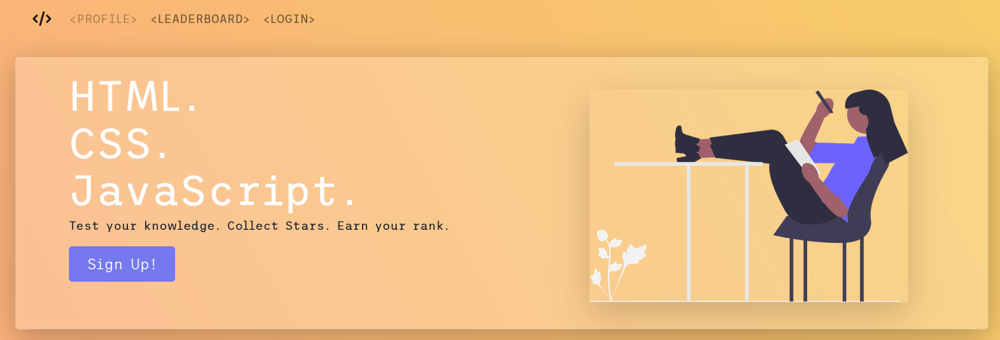

# Quiz App
___

  
[https://cool-as-code.netlify.app/](https://cool-as-code.netlify.app/)

## A quiz on Web Development basics 
Quiz App is a simple web application built with HTML, CSS/Bootstrap 5, and JavaScript.

## About
This project was created in the context of a Hackathon for the Developers Institute Full Stack Python Bootcamp.
It's a single page application, making heavy use of DOM manipulation, that features:
- user signup
- user authentication
- a leaderboard
- time limit with indication of remaining time
- immediate visual feedback of answers
- localStorage of data, passwords are Base64 encoded.

## Usage
As a first time user you'd need to create an account by clicking on the Sign Up! button and logging in. Once logged in, 
head to the Profile section by clicking the corresponding link in the top navigation bar. From the Profile section you can
choose a quiz topic.

## Quiz rules
- Each topic has a pool of 30 questions from where 10 random questions are selected.
- You have 10 seconds to answer each question.
- When not answering within the time limit, you receive a penalty of -1 points.
- You receive +1 points for a correct answer.
- Wrong answers do not come with any penalty.

You receive 1 Star for every 10 points you earn. You can see your Stars under the Profile section or by opening the
Leaderboard from the navigation bar.

## Demo

